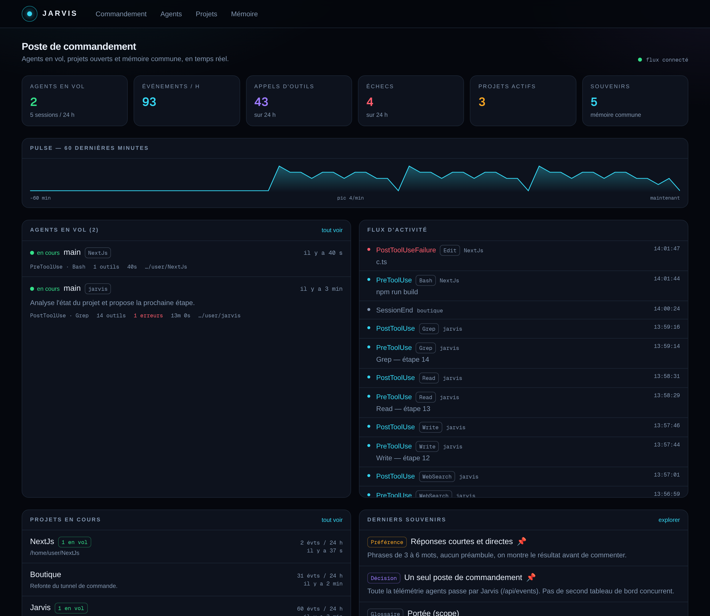

# Jarvis

Poste de commandement pour agents IA : voir qui tourne, où en sont les projets, et
entretenir une **mémoire commune** que tous les agents lisent et font évoluer.



---

## Ce que ça fait

| Vue | Réponse à la question |
| --- | --- |
| **Commandement** (`/`) | Qu'est-ce qui tourne *là maintenant* ? |
| **Agents** (`/agents`) | Que fait précisément cette session, outil par outil ? |
| **Projets** (`/projects`) | Où en est chaque chantier, et que sait-on sur lui ? |
| **Mémoire** (`/memory`) | Que savent mes agents, et comment ce savoir a-t-il changé ? |

Les agents n'ont rien à intégrer : les **hooks Claude Code** poussent leurs
événements de cycle de vie vers Jarvis, qui les stocke et les diffuse en direct.

---

## Démarrer

```bash
npm install
npm run dev              # http://localhost:3000
npm run jarvis:seed      # (autre terminal) jeu de démonstration
```

Brancher un projet pour de vrai :

```bash
node scripts/install-hooks.mjs /chemin/vers/mon-projet
# puis relancer Claude Code dans ce projet
```

`install-hooks.mjs` fusionne les hooks dans le `.claude/settings.json` du projet
cible (sauvegarde `.bak` automatique, hooks existants conservés).

---

## Architecture

```
Claude Code ──hooks──▶ scripts/jarvis-hook.mjs ──HTTP──▶ /api/events
                                                             │
                                               SQLite (node:sqlite, WAL)
                                                   │              │
                                         SSE /api/stream     /api/memory
                                                   │              │
                                              Dashboard      Agents & CLI
```

**Choix structurants**

- **`node:sqlite`** — pas de dépendance native, pas de serveur de base : `npm install` suffit.
  La base vit dans `data/jarvis.db` (hors Git). `JARVIS_DB_PATH` la déplace.
- **Un hook ne bloque jamais un agent** — `jarvis-hook.mjs` sort toujours en code 0,
  avec un timeout de 1,5 s. Jarvis éteint ⇒ les sessions continuent, sans bruit.
- **SSE plutôt que polling** — une connexion, des rafraîchissements groupés côté client.
- **Les projets s'auto-déclarent** — un agent qui émet depuis un dossier crée sa fiche projet.

---

## La mémoire commune

C'est la pièce centrale : un socle de savoir partagé par tous les agents,
que chacun peut enrichir.

**Un souvenir** porte un titre, un contenu, une *nature* et une *portée*.

- **Nature** : `decision`, `preference`, `pitfall`, `fact`, `pattern`, `glossary`, `person`.
  Elle pilote l'ordre d'injection : décisions et préférences d'abord, car ce sont
  elles qui doivent survivre à un contexte tronqué.
- **Portée** : `global` (tous les agents) ou `project:<slug>` (agents de ce projet).

**Elle évolue sans rien perdre.** Réécrire un souvenir de même titre et même portée
ne crée pas un doublon : la version passe à n+1, l'ancienne est archivée dans
`memory_revisions`, et la confiance monte quand un fait est reconfirmé. L'onglet
Mémoire affiche cet historique.

### Depuis un agent ou un terminal

```bash
# Ce que Jarvis sait sur un sujet
npm run jarvis:memory -- recall "déploiement" --project=jarvis

# Lui apprendre quelque chose
npm run jarvis:memory -- remember "Déploiement via Vercel" \
  "Pas de build manuel : tout passe par la CI." --kind=decision --scope=project:jarvis

# Brief markdown à coller en tête de contexte d'un agent
npm run jarvis:memory -- context --project=jarvis
```

Cette dernière commande est le point d'entrée le plus utile : elle produit le
markdown que n'importe quel agent peut ingérer avant de commencer à travailler.

---

## API

| Méthode | Route | Rôle |
| --- | --- | --- |
| `POST` | `/api/events` | Ingestion d'un événement ou d'un lot (max 200) |
| `GET` | `/api/events` | Flux historique (`limit`, `sessionId`, `projectId`, `since`) |
| `GET` | `/api/sessions` | Sessions agents et leur statut dérivé |
| `GET` `POST` | `/api/projects` | Fiches projets + agrégats live |
| `GET` `POST` | `/api/memory` | Lire / écrire la mémoire commune |
| `GET` `PATCH` `DELETE` | `/api/memory/[id]` | Un souvenir, ses révisions, son remplacement |
| `GET` | `/api/memory/search?q=` | Recherche plein texte (FTS5) |
| `GET` | `/api/memory/context` | Brief markdown injectable |
| `GET` | `/api/stats` | Compteurs + pulse 60 min |
| `GET` | `/api/stream` | Flux SSE temps réel |

### Statuts de session

Déduits du dernier événement reçu : `running`, `waiting` (permission ou
notification), `error` (échec d'outil), `idle` (`Stop`, ou plus de 5 min de silence),
`done` (`SessionEnd`).

---

## Configuration

| Variable | Défaut | Rôle |
| --- | --- | --- |
| `JARVIS_URL` | `http://localhost:3000` | Cible des hooks et du CLI |
| `JARVIS_DB_PATH` | `./data/jarvis.db` | Chemin absolu de la base |
| `JARVIS_TOKEN` | *(vide)* | Si défini, exige `Authorization: Bearer` en écriture |
| `JARVIS_TIMEOUT_MS` | `1500` | Budget temps d'un hook |
| `JARVIS_APP` / `JARVIS_PROJECT` | nom du dossier | Force le nom / slug du projet |

> **Exposer Jarvis hors de `localhost` impose de définir `JARVIS_TOKEN`.** Sans
> token, toute personne atteignant le port peut écrire dans la mémoire commune.

---

## Ce qui existe ailleurs

Repères pris avant d'écrire la première ligne :

- [disler/claude-code-hooks-multi-agent-observability](https://github.com/disler/claude-code-hooks-multi-agent-observability)
  — la référence sur la télémétrie par hooks (Bun + SQLite + Vue). Jarvis reprend
  l'idée du pipeline hook → HTTP → SQLite → WebSocket, en Next.js et en y ajoutant
  la mémoire et les projets.
- [OpenJarvis](https://github.com/open-jarvis/OpenJarvis), [jarvis.pm](https://jarvis.pm/),
  [01RG0/jarvis](https://github.com/01RG0/jarvis) — assistants personnels auto-hébergés,
  centrés sur l'exécution locale plus que sur la supervision.
- **Couches mémoire** : [Mem0](https://mem0.ai) (personnalisation rapide),
  [Zep](https://getzep.com) (graphe temporel), [Letta](https://letta.com) (agent qui
  gère sa propre mémoire), [Cognee](https://cognee.ai) (graphe partagé multi-agents).
  Jarvis reste volontairement en dessous : SQLite + FTS5, sans embeddings, tant
  qu'une recherche lexicale suffit.
- Côté créateurs (reels « build your own Jarvis ») le discours converge sur quatre
  briques : un hébergement, un modèle, **une mémoire**, des outils. C'est exactement
  le découpage retenu ici.

---

## Suite

- [ ] Serveur MCP exposant `recall` / `remember` en outils natifs
- [ ] Recherche sémantique (embeddings locaux) en complément du FTS5
- [ ] Détection de contradictions entre souvenirs
- [ ] Interruption d'un agent et réponse aux demandes de permission depuis le dashboard
- [ ] Vue coûts et tokens par session
