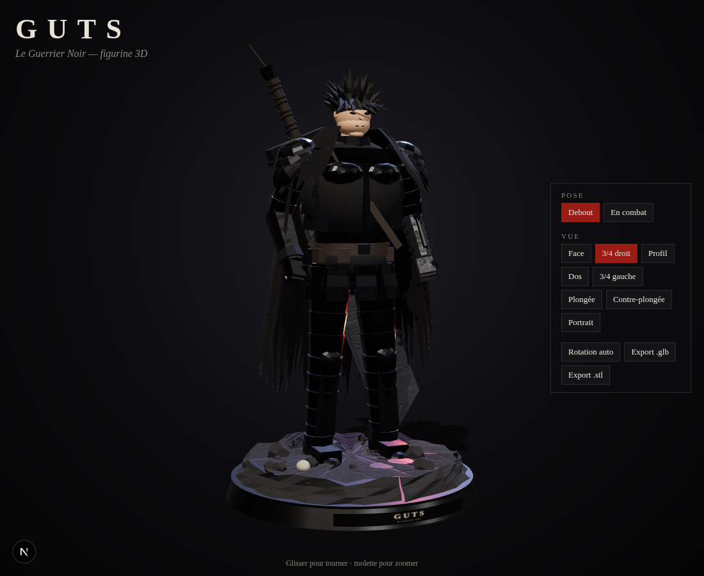
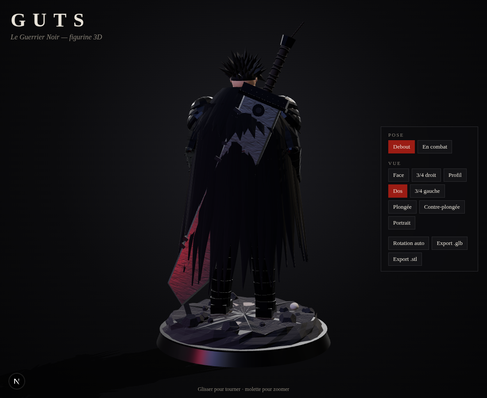
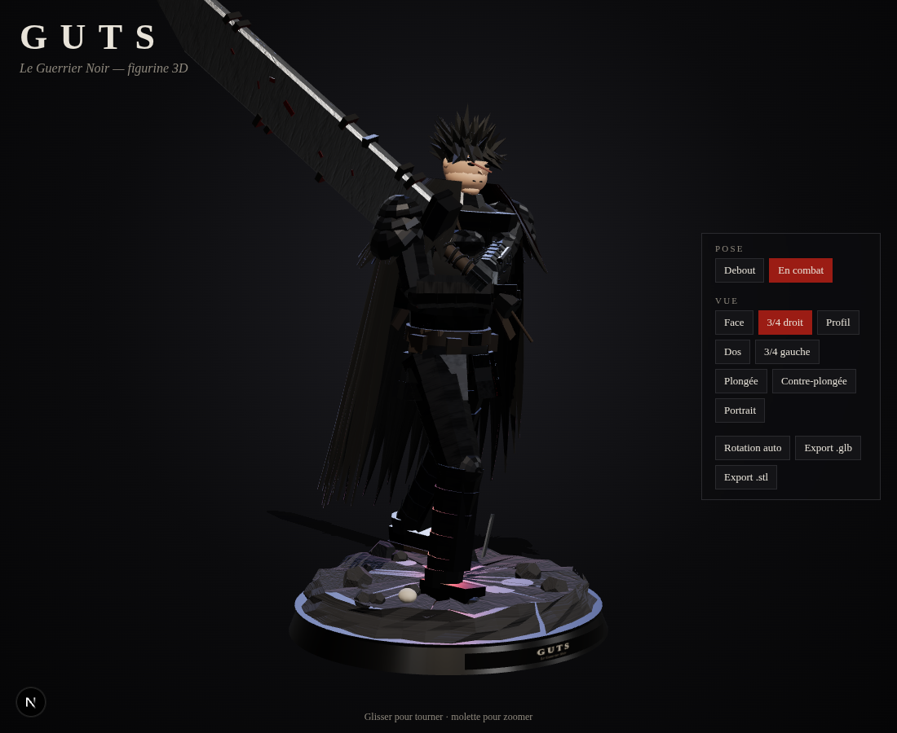

# NextJs

Learning nextJs — figurine 3D procédurale de **Guts** (Berserk), rendue avec Three.js.

## Lancer

```bash
npm install
npm run dev
# http://localhost:3000
```

## Contenu

- `lib/guts.ts` — modèle construit par code : armure du Berserker en plaques, cape déchiquetée,
  bras gauche prothèse, cheveux en pointes, cicatrice, Dragon Slayer, socle rocheux avec plaque.
- `components/GutsViewer.tsx` — scène, éclairage, caméra orbitale, vues prédéfinies
  (face, 3/4, profil, dos, plongée, contre-plongée, portrait), poses (debout / en combat).
- Export `.glb` (Blender, visionneuses) et `.stl` (impression 3D) depuis l'interface.

## Aperçu

| Debout | Dos | En combat |
| --- | --- | --- |
|  |  |  |
